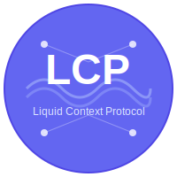

# Liquid Context Protocol (LCP)

<div align="center">



**The meta-layer specification for autonomous AI context orchestration**

[](https://opensource.org/licenses/MIT)
[](./SPECIFICATION.md)
[](./ROADMAP.md)

<!-- ALL-CONTRIBUTORS-BADGE:START - Do not remove or modify this section -->
[](#contributors-)
<!-- ALL-CONTRIBUTORS-BADGE:END -->

[](https://github.com/Turf-Tech/lcp-spec/stargazers)
[](https://github.com/Turf-Tech/lcp-spec/network/members)
[](https://github.com/Turf-Tech/lcp-spec/watchers)

[📖 Documentation](#documentation) •
[🚀 Quick Start](#quick-start) •
[🤝 Contributing](#community) •
[🗺️ Roadmap](./ROADMAP.md) •
[💬 Discussions](https://github.com/Turf-Tech/lcp-spec/discussions)

</div>

---

## What is LCP?

LCP (Liquid Context Protocol) is an open protocol specification that enables AI agents to autonomously discover, negotiate for, verify, and settle payments for contextual data—all without human intervention or trusted intermediaries.

While [MCP](https://modelcontextprotocol.io/) solves how AI systems connect to data sources and [A2A](https://developers.googleblog.com/en/a2a-a-new-era-of-agent-interoperability/) handles agent-to-agent coordination, **LCP provides the missing orchestration layer**: how agents autonomously find unfamiliar providers, negotiate acceptable terms, verify cryptographic proofs, and settle payments atomically.

### The Problem

By 2026, AI agents are everywhere—40% of enterprise applications will include task-specific agents. Yet these agents cannot:
- Discover context providers they've never used before (no permissionless discovery)
- Negotiate pricing and quality guarantees autonomously (no machine-to-machine bargaining)
- Verify data provenance without trusting providers (no cryptographic guarantees)
- Settle payments trustlessly (counterparty risk persists)

### The Solution

LCP provides four core primitives:

<table>
<tr>
<td width="25%" align="center">
<br>
<b>🔍 Permissionless Discovery</b><br>
<sub>Find providers through decentralized registries without gatekeepers</sub>
</td>
<td width="25%" align="center">
<br>
<b>🤝 Autonomous Negotiation</b><br>
<sub>Multi-round bargaining over price, quality, latency, and schemas</sub>
</td>
<td width="25%" align="center">
<br>
<b>🔐 Cryptographic Verification</b><br>
<sub>Provenance proofs, timestamps, quality attestations enforced by protocol</sub>
</td>
<td width="25%" align="center">
<br>
<b>⚡ Atomic Settlement</b><br>
<sub>Trustless payment via escrow, HTLCs, or on-chain settlement</sub>
</td>
</tr>
</table>

## ✨ Key Features

- 🌐 **Protocol-Agnostic** — Works with any transport (HTTP, WebSocket, P2P)
- ⛓️ **Multi-Chain** — Settle on Ethereum, Polygon, Arbitrum, or custom chains
- 🔒 **Zero Trust** — All guarantees enforced cryptographically, not by intermediaries
- 📊 **Real-Time Pricing** — Dynamic pricing based on demand, quality, and reputation
- 🛡️ **Built-in Security** — Fraud proofs, dispute resolution, reputation systems
- 🔌 **Extensible** — Custom capability types, verification mechanisms, settlement patterns
- 🤖 **AI-Native** — Designed specifically for autonomous agent interactions
- 🌍 **Interoperable** — Integrates with MCP, A2A, ERC-8004

## 🛠️ Technology Stack

<div align="center">


</div>

## 🚀 Quick Start

### For Agent Developers

```typescript
import { LCPClient } from '@lcp/client'

const client = new LCPClient({
  did: 'did:example:my-agent',
  registries: ['ethereum:0x...', 'dht://...']
})

// 1. Discover providers
const providers = await client.discover({
  capability_type: 'market_data',
  max_price: { amount: 0.002, currency: 'USDC' }
})

// 2. Negotiate terms
const agreement = await client.negotiate(providers[0], {
  parameters: { symbols: ['AAPL', 'GOOGL'] },
  max_price: { amount: 0.0015, currency: 'USDC' }
})

// 3. Receive context with verification
const context = await client.requestContext(agreement)
const verified = await client.verify(context)  // Automatic cryptographic verification

// 4. Settlement happens automatically on verification
```

### For Data Providers

```typescript
import { LCPProvider } from '@lcp/provider'

const provider = new LCPProvider({
  did: 'did:example:my-provider',
  capabilities: [{
    id: 'cap_market_data',
    type: 'market_data',
    pricing: { base_price: { amount: 0.001, currency: 'USDC' } }
  }]
})

// Handle negotiation
provider.on('negotiation', async (request) => {
  const price = dynamicPricing.calculate(request)
  return { status: 'accepted', price }
})

// Deliver context with proofs
provider.on('context_request', async (request) => {
  const data = await fetchMarketData(request.parameters)
  return {
    data,
    proof: await generateMerkleProof(data),
    timestamp: await blockchainAnchor(data)
  }
})
```

## Documentation

### Core Specification

1. [Introduction](./docs/01-introduction.md) — Problem, thesis, and design principles
2. [Architecture](./docs/02-architecture.md) — System components and interactions
3. [Core Components](./docs/03-core-components.md) — Data structures and schemas
4. [Discovery Protocol](./docs/04-discovery.md) — Finding providers permissionlessly
5. [Negotiation Protocol](./docs/05-negotiation.md) — Autonomous term agreement
6. [Verification Protocol](./docs/06-verification.md) — Cryptographic proofs and fraud detection
7. [Settlement Protocol](./docs/07-settlement.md) — Atomic payment mechanisms
8. [Trust Model](./docs/08-trust-model.md) — Security, reputation, and attack mitigations
9. [Extensions](./docs/09-extensions.md) — Custom capabilities and future directions

### Examples

- [Basic Context Request](./examples/basic-context-request.md) — End-to-end single-provider flow
- [Multi-Agent Coordination](./examples/multi-agent-coordination.md) — Complex multi-source aggregation
- [Data Provider Integration](./examples/data-provider-integration.md) — How to build an LCP provider

### JSON Schemas

- [Provider Capability Descriptor](./schemas/provider-capability.json)
- [Agent Context Request](./schemas/agent-request.json)
- [Context Response Metadata](./schemas/context-metadata.json)
- [Settlement Receipt](./schemas/settlement-receipt.json)

## Community

### Get Involved

We welcome contributions! Here's how you can help:

- **📖 Improve Documentation** — Clarify specs, add examples, fix typos
- **💡 Propose Features** — Submit RFCs for protocol enhancements
- **🔧 Build Implementations** — Create client/server libraries in your favorite language
- **🔒 Security Research** — Audit cryptographic implementations, find vulnerabilities
- **🎓 Create Tutorials** — Help onboard new developers
- **🐛 Report Issues** — Found a problem? Let us know!

**New to LCP?** Start with:
1. Read the [Introduction](./docs/01-introduction.md)
2. Review [Contributing Guidelines](./CONTRIBUTING.md)
3. Check the [Roadmap](./ROADMAP.md) for current priorities
4. Join discussions in [GitHub Discussions](#)

### Communication Channels

- **GitHub Issues** — Bug reports and feature requests
- **GitHub Discussions** — Questions, ideas, general discussion
- **RFCs** — Formal protocol change proposals in `rfcs/`

### Governance

LCP is a community-driven open protocol. See:
- [Governance Model](./GOVERNANCE.md) — How decisions are made
- [Code of Conduct](./CODE_OF_CONDUCT.md) — Community standards
- [Contributors](./CONTRIBUTORS.md) — Recognition for contributions

## Status

**Current Version**: 0.1.0 (Draft)

LCP is in active development. The specification is stabilizing but may still have breaking changes. See [ROADMAP.md](./ROADMAP.md) for planned developments toward 1.0.

🔴 **Not Production-Ready**: Suitable for research, prototyping, and feedback
🟡 **Seeking Feedback**: We actively want your input on design decisions
🟢 **Reference Implementations**: Coming soon

## Roadmap

- **Q1 2026**: Specification stabilization (current phase)
- **Q2 2026**: Reference implementations (TypeScript, Python, Rust)
- **Q3 2026**: Security audits and compliance test suite
- **Q4 2026**: Version 1.0 release candidate

See [ROADMAP.md](./ROADMAP.md) for details.

## Related Protocols

LCP is designed to complement existing agent infrastructure:

| Protocol | Purpose | Relationship to LCP |
|----------|---------|---------------------|
| **[MCP](https://modelcontextprotocol.io/)** | Standardized AI-to-data connections | LCP uses MCP-compatible interfaces for delivery |
| **[A2A](https://developers.googleblog.com/en/a2a-a-new-era-of-agent-interoperability/)** | Agent-to-agent coordination | LCP handles agent-to-provider transactions in A2A workflows |
| **[ERC-8004](https://www.quillaudits.com/blog/ai-agents/erc-8004)** | On-chain agent reputation | LCP integrates ERC-8004 for provider/consumer trust |

## License

This project is licensed under the [MIT License](./LICENSE).

By contributing to LCP, you agree that your contributions will be licensed under the MIT License.

## Citation

If you reference LCP in academic work, please cite:

```bibtex
@misc{lcp2026,
  title={Liquid Context Protocol: A Meta-Layer for Autonomous AI Context Orchestration},
  author={Turf Network},
  year={2026},
  url={https://github.com/Turf-Tech/lcp-spec}
}
```

## Acknowledgments

LCP builds on research and insights from:
- Anthropic's Model Context Protocol (MCP)
- Google's Agent2Agent Protocol (A2A)
- Ethereum's ERC-8004 standard for AI agent reputation
- Academic research in autonomous negotiation and zero-knowledge proofs

Special thanks to all [contributors](./CONTRIBUTORS.md) who have helped shape this protocol.

---

**Questions?** Open a [discussion](https://github.com/Turf-Tech/lcp-spec/discussions) or read the [FAQ](./docs/FAQ.md) (coming soon).

**Security Issue?** Please report responsibly to security@lcp.org or via [private disclosure](#).

---

## 📊 Project Stats

<div align="center">


</div>

## 👥 Contributors ✨

Thanks goes to these wonderful people ([emoji key](https://allcontributors.org/docs/en/emoji-key)):

<!-- ALL-CONTRIBUTORS-LIST:START - Do not remove or modify this section -->
<!-- prettier-ignore-start -->
<!-- markdownlint-disable -->
<table>
  <tbody>
    <tr>
      <td align="center" valign="top" width="14.28%"><a href="https://github.com/turf_network"><br /><sub><b>Turf Network</b></sub></a><br /><a href="#code-turf_network" title="Code">💻</a> <a href="#doc-turf_network" title="Documentation">📖</a> <a href="#design-turf_network" title="Design">🎨</a> <a href="#ideas-turf_network" title="Ideas & Planning">🤔</a> <a href="#infra-turf_network" title="Infrastructure">🚇</a> <a href="#maintenance-turf_network" title="Maintenance">🚧</a></td>
    </tr>
  </tbody>
</table>

<!-- markdownlint-restore -->
<!-- prettier-ignore-end -->

<!-- ALL-CONTRIBUTORS-LIST:END -->

This project follows the [all-contributors](https://github.com/all-contributors/all-contributors) specification. Contributions of any kind welcome!

See [CONTRIBUTORS.md](./CONTRIBUTORS.md) for the full list of contributors.

## 🙏 Acknowledgments

<table>
<tr>
<td align="center" width="25%">
<br>
<b>Anthropic</b><br>
<sub>Model Context Protocol</sub>
</td>
<td align="center" width="25%">
<br>
<b>Google</b><br>
<sub>Agent2Agent Protocol</sub>
</td>
<td align="center" width="25%">
<br>
<b>Ethereum</b><br>
<sub>ERC-8004 Standard</sub>
</td>
<td align="center" width="25%">
<br>
<b>Research Community</b><br>
<sub>ZK Proofs & Autonomous Agents</sub>
</td>
</tr>
</table>

## 📜 License

<div align="center">

This project is licensed under the [MIT License](./LICENSE).

**Copyright © 2026 Turf Network**

[](https://opensource.org/licenses/MIT)

</div>